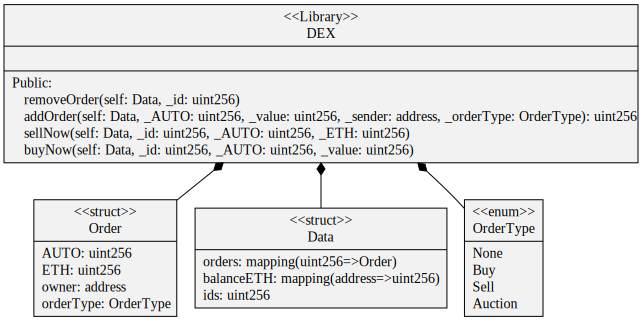
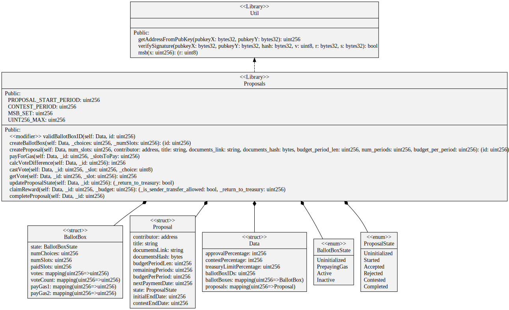
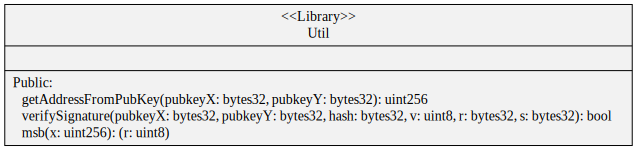
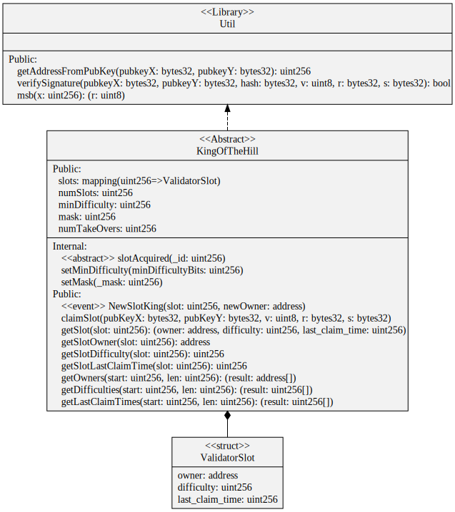
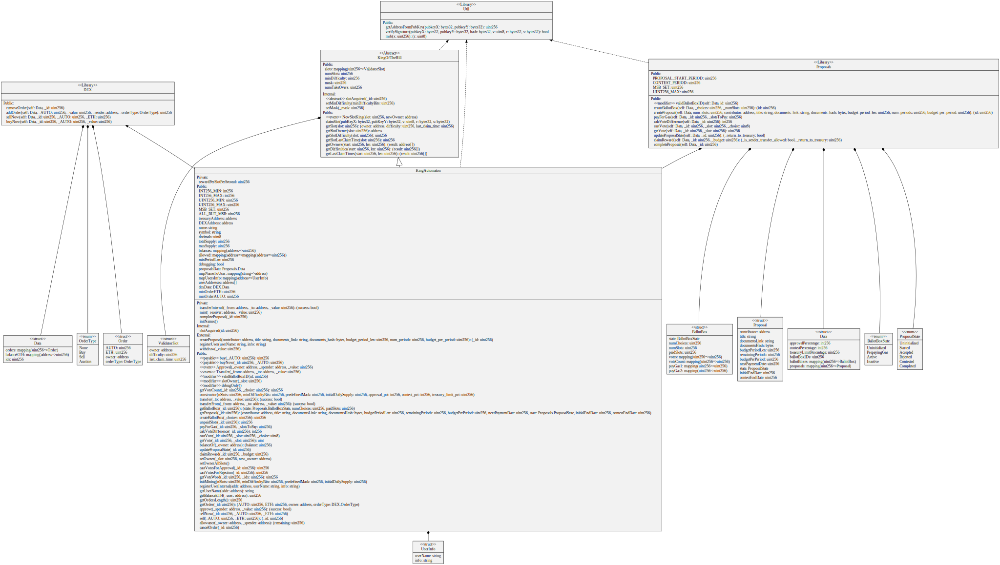

# automaton-bootstrap
Automaton Bootstrap Smart Contracts

## Build Status

Smart Contract Tests:

Smart Contract Coverage:

## Smart Contract Diagrams

**DEX**

**Proposals**

**Util**

**KingOfTheHill**

**KingAutomaton**

